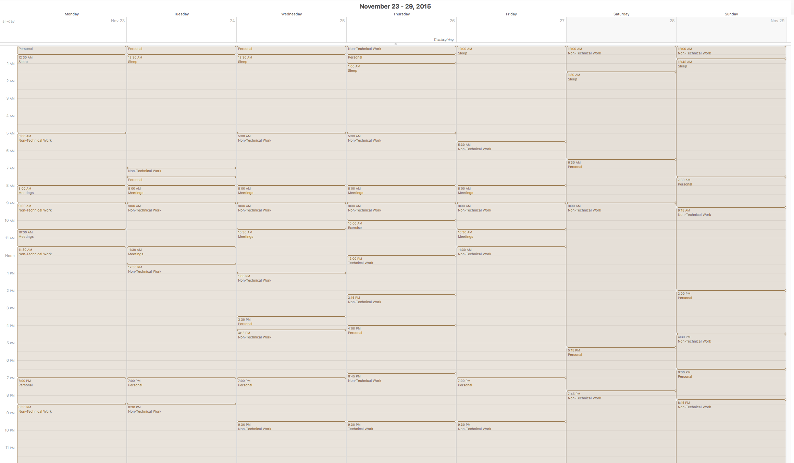

# Personal Time-Activity Data From Three Months At Techstars Cloud 2016
_(Also called: A dataset of how I spent my time at a startup incubator)_

## [Read the full article here](http://chrisalbon.com/writing/what_i_learned_from_tracking_my_time_at_techstars.html)

## Repo Summary

In the fall of 2015 the company I cofounded, [Popily](http://popily.com), was accepted into the 2016 class of Techstars Cloud. After being accepted, I read a number of articles from people describing what it was actually like at a major incubator, having never done so myself. However, all of those resources were anecdotal and I worried about bias around the incentive to inflate how many hours they works etc. I decided what as missing in descriptions of the Techstars experience was data. So for three months, from November 2, 2015 to January 31, 2016 (the program actually ends February 11th, so this isn't complete data) I recorded how I spent my time. This repo contains that data.

### Data Collection Methodology

Initially I attempted to use a time tracking application, however I was unhappy with the method. First, it was difficult to remember to use the time tracker. This meant I was regularly going back and retroactively adjusting times (e.g. waking up but only remembering to change the activity in the time tracker hours later). Second, the precise nature of the time (i.e. "woke up at 06:03:14am") gave an impression of precision which did not exist in the data. I don't know the precise minute I woke up, and wanted to data to reflect that ambiguity.

The data collection method I ended up using, and was happy with during the entire three months was simple and eloquent (suggested by my cofounder [Vidya Spandana](http://www.vidyaspandana.com/)): a Google calendar. I created a new Google calendar just for time tracking and created events for all activities. Below is a screenshot of that calendar for one week.

There are three caveats to the Google Calendar data collection method. First, the data is not precise to the minute. Google calendar defaults to 15 minute increments and I kept that default to acknowledge of the imprecision associated with tracking every minute of your life. Thus, if a "Sleep" activity ends at 6:15am, it means that I woke up at roughly 6:15am, but it could have been 6:10am or 6:20am. Second, I often did not record time "live." That is, often I retroactively recorded my time hours or even in few cases (particularly while traveling during the holidays) days afterwards. However, I did make it a point to record my time on notecards or scraps of paper and used those to guide my retroactive data recording. It wasn't perfect, but the data reflects by best, honest attempt at tracking my time. Finally, at some point I decided to not allow any event to roll over to the next day. For this reason, some events (particularly sleep) which start at night on one day and end in the morning of another day are listed as two events, one for the first day and one for the second day.

## Codebook

The raw data was collected in a Google calendar and then exported to csv using [Gcal2Excel](https://www.gcal2excel.com/). It was then cleaned and wrangled in python/pandas and divided into seven individual datasets. The full code is in `clean.ipynb`. Below is an explanation of all variables in each of the datasets. Note that not all variables exist in each database.

All the datasets below are available in the `clean_data` folder.

### Description of variables
- **Activity**: Every 15 minute increment during the three months was coded as being one of six types of activities. The six categories were decided prior to data collection and were meant to cover all possible activities. A description of each activity type is below.
  1. _Sleep:_ Any time I was in bed (or a few times in my car) trying to sleep.
  2. _Personal_: Any time spent on non-work activities including showering or spending time with family or friends.
  3. _Non-Technical Work_: Any work on Popily that was not directly related to code or other technical areas. This includes writing (including this readme file), email, etc. Notably, it also includes the many hours I spent in Pivotaltracker writing, managing, updating, and checking user stories.
  4. _Technical Work_: Any work on Popily that involved code, math, statistics, etc.
  5. _Discussion_: Any work on Popily that was mostly talking with other people. This includes internal team discussions over the dinner table, discussions with contractors, meetings with mentors, or even drinks out with other Techstar teams. While it might seem odd to lump them all together, I can say with utter confidence that any discussion other than with family or friends over the last three months has been around Popily, whether I am in a conference room, dinner table, or a bar.
  6. _Travel_: Any time I was focused on traveling (notably driving) and not able to do any work.
  7. _Exercise_: Any time I was out on a run, which was essentially never.
- **Start**: The start time of an activity.
- **End**: The end time of an activity.
- **Duration**: The duration of an activity in factions of an hour. So 1.5 is equal to one and a half hours. The duration is broken down into quarters of an hour.
- **Date**: The day of the activity.
- **Holiday**: The holiday of an activity (when applicable).

### Description of datasets

- **activity_data.csv**: This dataset is a cleaned version of the raw data.
- **daily_data.csv**: Contains daily totals for each type of activity
- **holiday_data.csv**: The same data as daily_data.csv but containing only major holidays.
